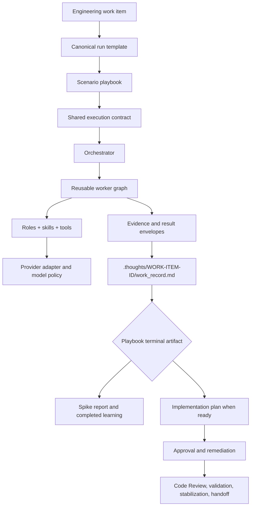
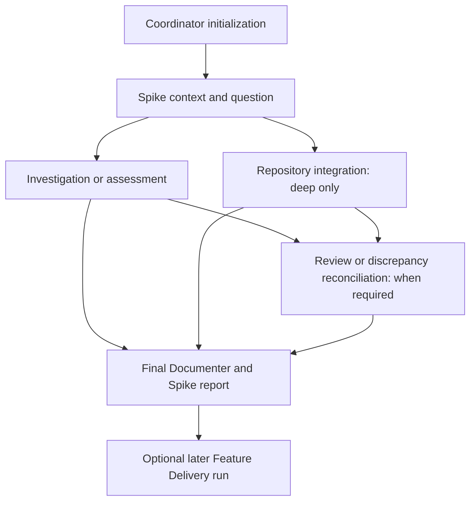
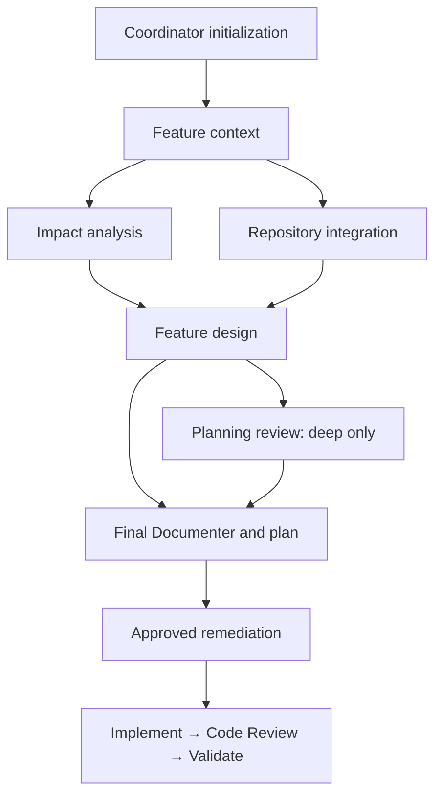
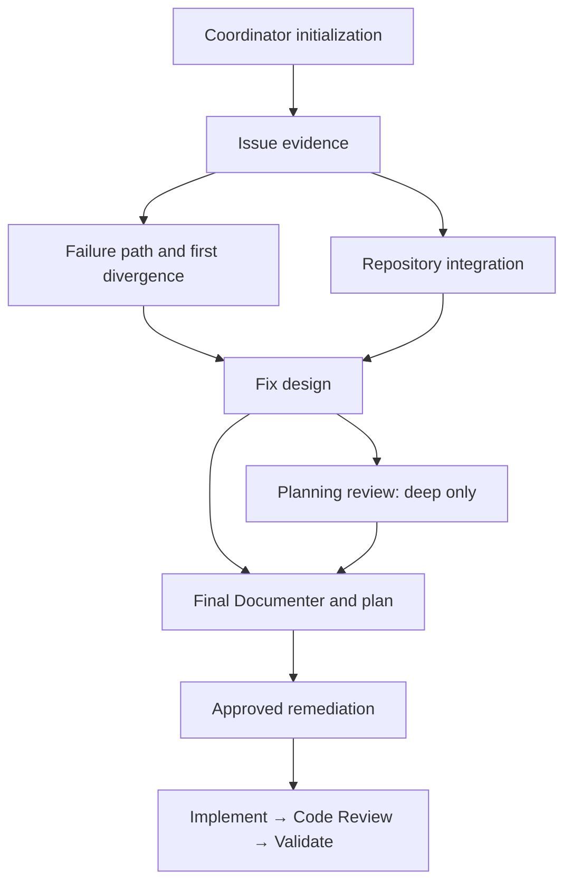
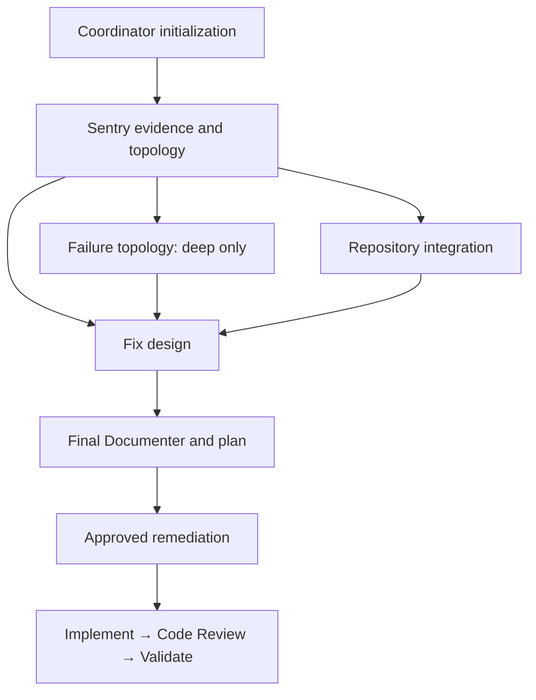
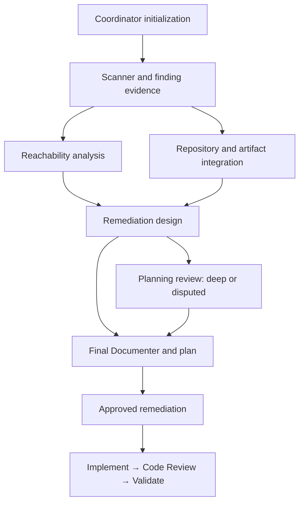

# Playbook Architecture Catalog

This catalog preserves the architecture, use cases, evidence sources, worker graphs, and current exercise state of the
workflow playbooks. It is a design reference; the playbook files remain the execution source of truth.

## Shared Architecture

Every playbook has `standard` and `deep` execution profiles. Delivery playbooks support `planning` and `remediation`;
Technical Spike is planning-only. Profiles add independent workers and review; they do not reduce role quality. The
Coordinator performs initialization directly; one final Documenter runs after analytical fan-in.

## Technical Spike

**Use for:** answering one bounded technical question or assessing an existing Spike report. **State:** Not exercised;
contract and static validation only.

The distinguishing seam is the learning artifact. A Technical Spike has a question, timebox or evidence budget,
discriminating checks, explicit uncertainty, and one disposition. It produces `spike_report.md`, not an implementation
plan, and never implies Feature Delivery readiness.

`standard` uses context plus one objective-specific analytical worker. `deep` adds repository integration in parallel;
executing a Spike also adds independent review. The run stops when the question is answered, the review disposition is
stable, the budget is exhausted, or indispensable evidence is unavailable.

## Feature Delivery

**Use for:** planned Jira features and improvements. **State:** Exercising; all profile/lifecycle combinations
exercised; reliability, control fidelity, and efficiency remain under validation.

Feature Delivery also supports a `specification_assessment` planning objective for judging an existing Spike,
proposal, or specification. This route reuses the planning graph but separates specification readiness from the ability
to draft future work.

The distinguishing seam is Jira Context Recovery: the ticket, its immediate parent and ancestor hierarchy, selected
related siblings, linked decisions, and repository evidence establish scope. Parent and sibling context informs the
ticket but does not silently become a requirement.

`standard` requires context, impact, design, and documentation; integration is conditional. `deep` makes integration and
planning review mandatory. If the minimum implementable outcome, affected surface, or acceptance condition cannot be
recovered, bounded discovery frames feasible options and a recommendation before the workflow requests clarification; it
does not invent a plan.

## TechOps Issue Remediation

**Use for:** support- and operations-reported Jira issues, including Zendesk or Help Desk reports with attachments,
logs, payloads, screenshots, or recordings. **State:** Exercising; all profile/lifecycle combinations exercised;
reliability, control fidelity, and efficiency remain under validation.

The report and its attachments are first-class evidence, but not proof of current behavior or cause. `standard` requires
issue evidence, failure-path analysis, fix design, and documentation; integration is conditional. `deep` adds mandatory
repository integration and independent planning review.

## Sentry Issue Remediation

**Use for:** a Sentry issue that needs evidence-led diagnosis and a minimal fix. **State:** Exercising; all
profile/lifecycle combinations exercised; reliability, control fidelity, and efficiency remain under validation.

The Current-State Investigator owns raw Sentry evidence. Downstream workers consume normalized artifacts rather than
repeating queries. `standard` uses bounded failure analysis in the Solution Architect; `deep` adds independent failure
topology and mandatory repository integration. When a decision remains, the workflow frames supported fix paths before
asking the owner to choose.

## Vulnerability Investigation

**Use for:** scanner findings, advisories, CVEs, secrets, or supply-chain risk. **State:** Exercising; recent bounded
Standard planning and remediation runs work well after substantial improvements. More Deep planning and remediation
scenarios are required before broader reliability or delivery-validation claims.

The playbook separates scanner severity from actual reachability and risk. Evidence, dependency path,
repository/artifact mapping, and risk disposition must be explicit before a remediation plan is accepted.

## Selection Guide

At initialization, the Coordinator records the primary evidence, primary goal, selected playbook, closest alternative,
and why the selected playbook is the better fit. This helps selection without adding another prompt field or replacing
the engineer's judgment.

| Primary evidence and goal | Playbook |
| --- | --- |
| Bounded technical question, experiment, feasibility decision, or existing Spike report | Technical Spike |
| Jira initiative, planned capability, or improvement | Feature Delivery |
| Support- or operations-reported Jira issue, attachments, logs, or unclear ownership | TechOps Issue Remediation |
| Sentry issue, event evidence, and production failure | Sentry Issue Remediation |
| Scanner, CVE, advisory, or security finding | Vulnerability Investigation |

Use the most specialized playbook with the evidence already available. See [ROADMAP.md](ROADMAP.md) for validation and
expansion policy.

Service Extraction is retired. Its playbook, prompt, and example were removed; do not select it as a current workflow.
