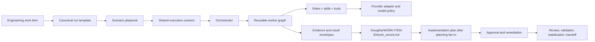
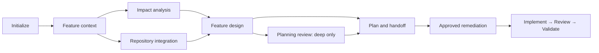
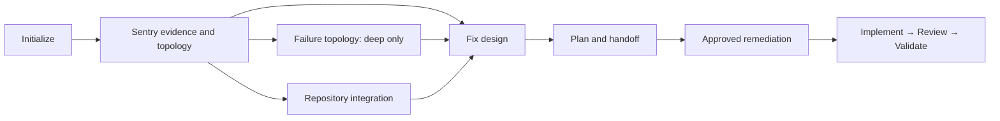
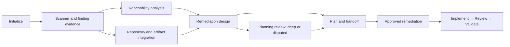
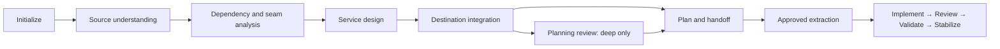

# Playbook Architecture Catalog

This catalog preserves the architecture, use cases, evidence sources, worker
graphs, and maturity of the workflow playbooks. It is a design reference; the
playbook files remain the execution source of truth.

## Shared Architecture

Every playbook has `standard` and `deep` execution profiles plus `planning`
and `remediation` lifecycles. Profiles add independent workers and review; they
do not reduce role quality. Planning is read-only, creates an implementation
plan only after fan-in, and requires explicit approval before remediation.

## Feature Delivery

**Use for:** planned Jira features and improvements within an active
initiative. **Maturity:** planning exercised; remediation not yet validated.

The distinguishing seam is Jira Context Recovery: the ticket, its immediate
parent and ancestor hierarchy, selected related siblings, linked decisions, and
repository evidence establish scope. Parent and sibling context informs the
ticket but does not silently become a requirement.

`standard` requires context, impact, design, and documentation; integration is
conditional. `deep` makes integration and planning review mandatory. If the
minimum implementable outcome, affected surface, or acceptance condition cannot
be recovered, bounded discovery frames feasible options and a recommendation
before the workflow requests clarification; it does not invent a plan.

## Sentry Issue Remediation

**Use for:** a Sentry issue that needs evidence-led diagnosis and a minimal
fix. **Maturity:** Standard and Deep planning validated; remediation lifecycle
remains under validation.

The Current-State Investigator owns raw Sentry evidence. Downstream workers
consume normalized artifacts rather than repeating queries. `standard` uses
bounded failure analysis in the Solution Architect; `deep` adds independent
failure topology and mandatory repository integration. When a decision remains,
the workflow frames supported fix paths before asking the owner to choose.

## Vulnerability Investigation

**Use for:** scanner findings, advisories, CVEs, secrets, or supply-chain risk.
**Maturity:** planning exercised; remediation not yet validated.

The playbook separates scanner severity from actual reachability and risk.
Evidence, dependency path, repository/artifact mapping, and risk disposition
must be explicit before a remediation plan is accepted.

## Service Extraction and Stabilization

**Use for:** decoupling an existing capability into an independently buildable,
runnable, deployable, and maintainable service. **Maturity:** not exercised;
real Jira planning and remediation validation remain pending.

Its distinguishing concern is the source-to-destination seam: contracts,
dependencies, operations, coexistence or cutover, rollback, and ownership.
It is not the default for a normal feature or improvement.

## Selection Guide

| Primary evidence and goal | Playbook |
| --- | --- |
| Jira initiative, planned capability, or improvement | Feature Delivery |
| Sentry issue, event evidence, and production failure | Sentry Issue Remediation |
| Scanner, CVE, advisory, or security finding | Vulnerability Investigation |
| Existing capability moved into a new independently operated service | Service Extraction and Stabilization |

Use the most specialized playbook with the evidence already available. Add a
new playbook only when a scenario has distinct stages, gates, or artifacts that
the existing playbooks cannot express cleanly.
