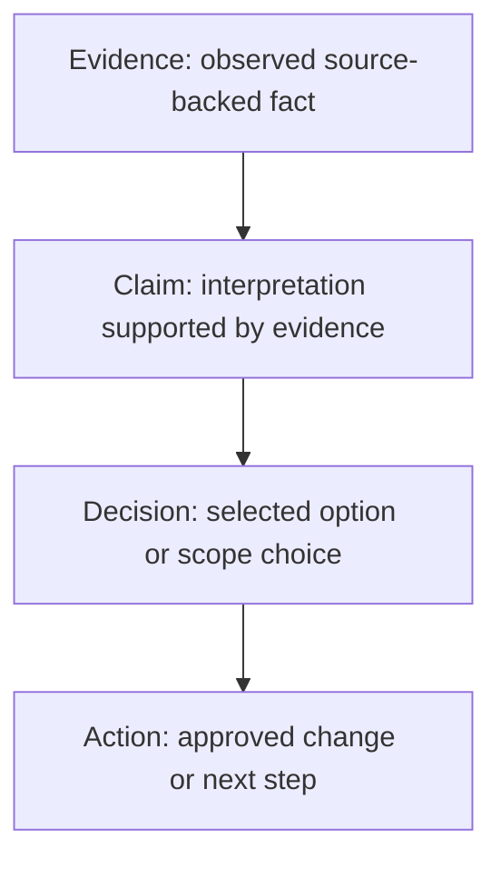

# Claims, Evidence, Decisions, and Actions Contract

> Make material workflow reasoning traceable from an observed fact to an approved action.

This contract is the shared reasoning record for every playbook. It does not
replace the work record or a playbook-specific artifact. It defines the IDs and
relationships that let a reviewer challenge a conclusion without relying on an
AI-generated summary alone.



## Definitions

| Type | Meaning |
| --- | --- |
| Evidence | A source-backed observation, measurement, or external result. Evidence may be verified, inferred, hypothesized, contradicted, or unknown. |
| Claim | A material statement derived from one or more evidence items. A claim must identify its supporting evidence and confidence. |
| Decision | A selected option, scope boundary, or disposition based on claims. A decision identifies its owner and approval status. |
| Action | A concrete implementation, validation, documentation, or follow-up step derived from a decision. |

## Required fields

### Evidence

| Field | Required | Description |
| --- | --- | --- |
| `evidence_id` | Yes | Stable ID within the work record, such as `evidence-001`. |
| `observation` | Yes | What was observed, without adding interpretation. |
| `source` | Yes | Repository path, ticket, log, command, scanner, or other source. |
| `observed_at` | Yes | When the observation was collected. |
| `worker` | Yes | Worker that collected or preserved the evidence. |
| `status` | Yes | `verified`, `inferred`, `hypothesized`, `contradicted`, or `unknown`. |
| `notes` | Recommended | Scope, limitations, or conflicting evidence. |

### Claim

| Field | Required | Description |
| --- | --- | --- |
| `claim_id` | Yes | Stable ID within the work record, such as `claim-001`. |
| `statement` | Yes | The material conclusion being asserted. |
| `evidence_refs` | Yes | Evidence IDs supporting or challenging the claim; use `Unknown` when none are available. |
| `confidence` | Yes | `high`, `medium`, `low`, or `unknown`. |
| `uncertainties` | Yes | Remaining gaps, conflicts, or limits that explain the confidence level. |
| `status` | Yes | `supported`, `inferred`, `hypothesized`, `contradicted`, or `unknown`. |

### Decision

| Field | Required | Description |
| --- | --- | --- |
| `decision_id` | Yes | Stable ID within the work record, such as `decision-001`. |
| `question_or_scope` | Yes | The question, boundary, or choice being resolved. |
| `claim_refs` | Yes | Claims used to make the decision. |
| `options_considered` | Yes | Options and meaningful tradeoffs considered. |
| `selected_option` | Yes | The selected option or disposition. |
| `rationale` | Yes | Why the selected option follows from the claims. |
| `decision_owner` | Yes | Human or role accountable for the decision. |
| `approval` | Yes | `not_required`, `pending`, `approved`, or `rejected`. |

### Action

| Field | Required | Description |
| --- | --- | --- |
| `action_id` | Yes | Stable ID within the work record, such as `action-001`. |
| `decision_ref` | Yes | Decision ID authorizing the action, or an explicitly recorded approved exception. |
| `action` | Yes | Concrete change, validation, documentation, or follow-up step. |
| `owner` | Yes | Worker, person, or team responsible for the action. |
| `required_gate` | Yes | Gate that must pass before the action may execute. |
| `status` | Yes | `proposed`, `approved`, `in_progress`, `completed`, `blocked`, or `cancelled`. |

## Rules

1. Record evidence before using it to support a material claim. Do not present
   an interpretation as an observation.
2. Every material claim must reference evidence or explicitly record why the
   evidence is unavailable. Confidence is an assessment of the claim, not proof
   of correctness.
3. Explain `high`, `medium`, and `low` confidence through the evidence and
   uncertainties. Use `unknown` when no defensible assessment is possible.
4. A decision is not the same as approval. A decision may recommend an option;
   its approval field controls whether an action may proceed.
5. Every action must reference the decision and gate that authorize it. An
   action must not execute before its required gate passes.
6. Preserve IDs when results move between workers, the work record, an
   implementation plan, and the final handoff.

## Example

```text
evidence-001: package X imports package Y.
claim-001: The extracted service has a runtime dependency on package Y.
  evidence_refs: [evidence-001]
  confidence: high
decision-001: Preserve package Y at the new service boundary.
  claim_refs: [claim-001]
  approval: approved
action-001: Add or preserve package Y in the destination dependency set.
  decision_ref: decision-001
  required_gate: implementation_approval
```
