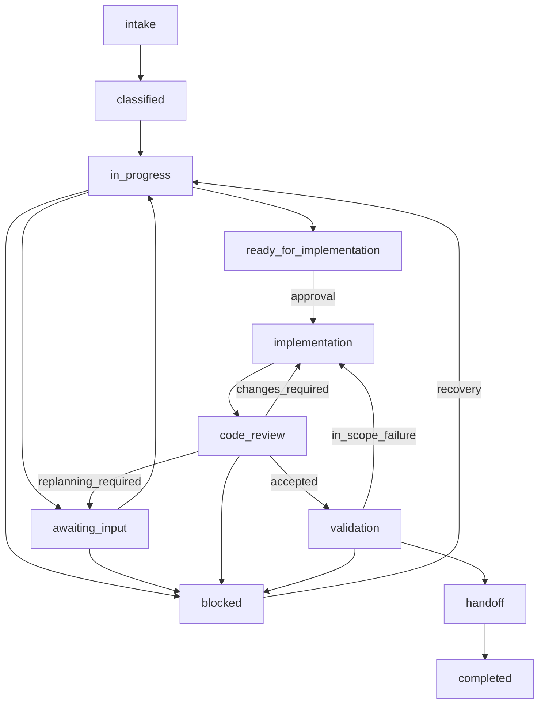

# Workflow Execution Contract

> Define the smallest shared contract for reusable playbooks, roles, skills, tools, workers, and provider-neutral
> execution.

This contract is the seam between the workflow definition and the platform that executes it. A provider may implement
the contract differently, but it must preserve the same inputs, outputs, evidence expectations, and completion
semantics.

The contract is intentionally small. It supports sequential, parallel, and conditional playbooks without requiring a
general orchestration backend or a live work-item connector.

## Normative Language

The keywords **MUST**, **MUST NOT**, **SHOULD**, **SHOULD NOT**, and **MAY** in this document are normative. They mean
respectively: required, prohibited, recommended unless a documented reason applies, discouraged unless a documented
reason applies, and permitted.

## Document Classification

The [Workflow Invariants](#workflow-invariants), contract tables, lifecycle gates, state machine, artifact rules, and
[Pilot Conformance Checklist](#pilot-conformance-checklist) are the normative core. They define the minimum required
behavior. Rationale, provider examples, and explanations of how to satisfy a requirement are implementation guidance;
they do not create additional gates. This keeps the contract authoritative without treating its explanatory prose as a
second specification.

| Classification | Location | Purpose |
| --- | --- | --- |
| Normative core | Invariants, contract tables, lifecycle gates, state machine, artifact rules, extension rules, and conformance checklist | Defines required behavior and conformance. |
| Implementation guidance | Rationale, examples, provider-flexibility explanations, and linked operating/provider guides | Explains how to satisfy the core without changing its required outcomes. |
| Non-normative example | [Illustrative Worker Profile](#illustrative-worker-profile-non-normative) | Shows one representation; it does not introduce a configuration language or additional requirements. |
| Normative checklist | [Pilot Conformance Checklist](#pilot-conformance-checklist) | Defines the minimum evidence required before a run may be called contract-compliant. |

---

# Vocabulary

| Term              | Meaning                                                                                                                                               |
| ----------------- | ----------------------------------------------------------------------------------------------------------------------------------------------------- |
| Work item         | The normalized request being handled, such as a Jira Story, bug, incident, or upgrade.                                                                |
| Coordinator       | The active session or runtime responsible for activating workers, collecting results, completing fan-in, and closing the run.                          |
| Workflow run      | One execution of a playbook for one work item.                                                                                                        |
| Execution repository | Repository where the workflow session starts and where durable run artifacts are stored.                                                        |
| Code repository   | Repository inspected or modified by the workflow. It may be the execution repository or an additional repository.                                  |
| Playbook          | A scenario-specific workflow made of stages, roles, skills, gates, and outputs.                                                                       |
| Stage             | A meaningful unit of work inside a playbook.                                                                                                          |
| Role              | A reusable responsibility and reasoning boundary.                                                                                                     |
| Skill             | A reusable capability required to perform work.                                                                                                       |
| Tool              | A concrete operation available to a worker.                                                                                                           |
| Capacity class | Internal provider-neutral reasoning-capacity metadata. |
| Worker | One execution instance: role, skills, tools, metadata, and inputs. Human, AI, or session work. |
| Artifact          | A durable output such as a map, decision, code change, test result, or handoff.                                                                       |
| Evidence          | A source-backed observation used to support or challenge a claim.                                                                                     |
| Claim             | A material statement derived from one or more evidence items, with an explicit confidence and uncertainty assessment.                                  |
| Decision          | A selected option, scope boundary, or disposition based on claims.                                                                                      |
| Action            | A concrete implementation, validation, documentation, or follow-up step derived from a decision.                                                       |
| Gate              | A condition that must be satisfied before a stage or transition can proceed.                                                                          |
| Adapter           | A provider-specific implementation at a defined seam, such as Jira, Git, or an AI platform.                                                           |
| Execution profile | A named selection of worker graph, investigation depth, and validation scope.                                                                         |
| Lifecycle         | How far a workflow run may proceed, such as planning or remediation.                                                                                  |
| Engineering state | What has been established about the work item, independently of the current workflow run.                                                            |
| Portable implementation handoff | A self-contained execution artifact that transfers an approved plan to another session or environment. |

Skills describe what capability is needed. Tools describe how that capability is performed. Provider-neutral capacity
classification describes requested reasoning capacity. These concepts must not be merged. They are internal worker
metadata, not normal run inputs.

The `orchestrator` is the reusable role that owns workflow coordination. The Coordinator is the active runtime
performing that role. A provider may run the role in a dedicated worker, or the main session may act as both Coordinator
and Orchestrator when nested delegation is unavailable.

The canonical role ID is the role filename without `.md`, such as `current_state_investigator` or
`repository_integrator`.

## Workflow Invariants

These invariants are the compact, testable surface of the detailed normative rules below. The referenced sections remain
the source of truth.

| ID | Invariant | Detailed rule |
| --- | --- | --- |
| `INV-01` | A run MUST declare one work item and one explicit execution repository. | [Work Item Contract](#work-item-contract); [Durable Artifact Root](#durable-artifact-root) |
| `INV-02` | A planning run MUST NOT modify source code or external systems. | [Workflow State Machine](#workflow-state-machine) |
| `INV-03` | A remediation run MUST have explicit implementation approval and recorded re-entry before source changes. | [Lifecycle Continuation and Re-entry](#lifecycle-continuation-and-re-entry) |
| `INV-04` | A requested execution profile MUST NOT be silently downgraded or reported as successfully executed at a lower profile. | [Profile Execution Semantics](#profile-execution-semantics) |
| `INV-05` | The Coordinator MUST NOT replace a required independent worker. | [Profile Execution Semantics](#profile-execution-semantics) |
| `INV-06` | Completion MUST require terminal envelopes for required workers and passed fan-in. | [Stage Completion and Fan-In](#stage-completion-and-fan-in) |
| `INV-07` | Runtime closure MUST be recorded before a run is closed or a new lifecycle run starts. | [Worker Runtime Closure](#worker-runtime-closure) |
| `INV-08` | Durable workflow artifacts MUST be stored under the execution repository's `.thoughts/<WORK-ITEM-ID>/`. | [Durable Artifact Root](#durable-artifact-root) |
| `INV-09` | Every material claim MUST identify evidence, confidence, uncertainty, and status. | [Evidence and Artifact Minimums](#evidence-and-artifact-minimums); [Claims Contract](claims.md) |
| `INV-10` | A decision is not approval; an action MUST have an authorizing decision and required gate. | [Evidence and Artifact Minimums](#evidence-and-artifact-minimums); [Claims Contract](claims.md) |
| `INV-11` | In-scope Code Review findings MUST return to implementation and review without requiring new approval. | [Delivery Code Review Loop](#delivery-code-review-loop) |
| `INV-12` | A handoff MUST report the actual profile, worker outcomes, limitations, artifact status, and a human-readable next action. | [Stage Completion and Fan-In](#stage-completion-and-fan-in); [Human-Readable Handoff](#human-readable-handoff); [Pilot Conformance Checklist](#pilot-conformance-checklist) |
| `INV-13` | An explicitly named path MUST be verified as a path before its existence, contents, or configuration status is reported. | [Explicit Path Verification](#explicit-path-verification) |
| `INV-14` | A current explicit user decision or constraint MUST be treated as authoritative, MUST override a historical worker conclusion, and MUST NOT be reopened as an unresolved decision. | [Authoritative Run Inputs](#authoritative-run-inputs) |
| `INV-15` | Every material detail supplied by the user MUST be preserved, classified, and either used by the workflow or explicitly recorded as unavailable, conflicting, or out of scope. | [Context Preservation and Classification](#context-preservation-and-classification) |
| `INV-16` | A worker wait timeout MUST NOT be treated as worker failure or authorize closing an active worker. | [Worker Wait and Termination Semantics](#worker-wait-and-termination-semantics) |
| `INV-17` | A portable implementation handoff MUST be self-contained, approval-gated, and based on repository identity and revision rather than source-environment paths. | [Portable Implementation Handoff](#portable-implementation-handoff) |
| `INV-18` | Material delivery changes MUST pass a strict Code Review covering relevant behavior paths, boundaries, scope, and coverage before validation is accepted. | [Delivery Code Review Loop](#delivery-code-review-loop) |
| `INV-19` | A portable implementation handoff MUST be created only for a cross-session or cross-environment transfer, or an explicit user request. | [Portable Implementation Handoff](#portable-implementation-handoff) |
| `INV-20` | Diagnosis and fix-design MUST pass the gate before clarification. | [Gate](#evidence-to-hypothesis-gate) |
| `INV-21` | Clarification MUST report executed checks. | [Gate](#evidence-to-hypothesis-gate) |
| `INV-22` | Local reproduction informs the current-code fix. | [Parity](#production-parity-prioritization) |
| `INV-23` | Planning MUST distinguish implementation-plan work from a true planning blocker. | [Planning Readiness and Implementation Work](#planning-readiness-and-implementation-work) |
| `INV-26` | Record why the playbook matches primary evidence and goal. | [Playbook Selection](#playbook-selection) |
| `INV-24` | Barrier before edits. | [Barrier](#delivery-activation-and-completion-barrier) |
| `INV-25` | Delivery gates and closure required. | [Barrier](#delivery-activation-and-completion-barrier) |

---

# Human Control Model

The engineer owns scope, decisions, approvals, and interpretation of results. An approval is explicit only when its
type, owner, scope, and recorded decision or plan are clear. One approval may cover more than one type only when that is
recorded explicitly.

| Approval type | Controls | Required for current playbooks |
| --- | --- | --- |
| `scope` | Expanding the declared work item, repositories, operational target, or non-goal. | Conditional: every playbook when the proposed work exceeds its declared scope. |
| `design` | Selecting a material solution, architecture, security posture, or rollout alternative. | Conditional: every playbook when a material decision remains after investigation. It may be combined with implementation approval. |
| `implementation` | Source, configuration, or other remediation changes in the approved plan. | Required: every playbook before `lifecycle: remediation`. |
| `release` | Deployment, cutover, production configuration, or other external operational write. | Conditional: every playbook when its plan includes such an action; implementation approval alone is insufficient. |

```text
User -> scope approval (when needed) -> planning -> design approval (when needed)
     -> implementation plan -> implementation approval -> remediation
     -> independent review -> validation -> release approval (when needed) -> handoff
```

Planning is read-only. An approved design is not implementation approval, and implementation approval is not release
approval.

## Authoritative Run Inputs

Run prompts may contain both authoritative user inputs and unverified investigation hints. They are different kinds of
input:

| Input | Required behavior |
| --- | --- |
| Confirmed user decision or constraint | Treat it as the current decision or constraint. Do not ask the user to confirm it again or replace it with an alternative. |
| Investigation hint, hypothesis, or topology guess | Test it against source, runtime, and work-item evidence. It may be corrected or rejected. |

Workers may explain the technical consequences of an authoritative input and may report direct evidence that makes it
inconsistent with the observed system. They must not silently override it or convert it into a clarification question.
If the user must deliberately change the decision, present the conflict and ask for a new decision explicitly.

A statement such as “FanMgmt is the source of truth for comparison scenarios” is an authoritative comparison rule when
it appears in the confirmed-decisions section or run constraints. It means the workflow must treat FanMgmt's result as
the expected baseline and investigate why the rules engine differs; it must not ask whether FanMgmt rows should instead
be merged, discarded, or treated as duplicates unless the user explicitly requests that decision.

## Context Preservation and Classification

All user-supplied context is workflow input. The Coordinator and prompt-preparation step must not discard material
details because they do not fit the first obvious field or because they are not yet verified.

Classify each material detail as one or more of:

- an authoritative decision or constraint;
- an observed report or requested outcome;
- an unverified hypothesis, hint, or topology assumption;
- a supporting artifact, reference, or data source;
- an ambiguity or conflict requiring reconciliation; or
- unavailable or out of scope.

Map the detail to a canonical field when one exists. Otherwise preserve it in the run's additional context and work
record's Input Register with its source and classification. Use `Unknown` only when the information is genuinely
unavailable; do not use it to erase information the user supplied. If inputs conflict, preserve both statements,
identify the conflict, and resolve it through evidence or an explicit user decision. Never silently drop, rewrite, or
replace user context.

The prompt-preparation request may contain context before or after its formal fields. The preparation step must read all
of it and fill the canonical run template. The user must not be required to copy the same information into a second
section manually.

Historical artifacts, including prior plans, work records, and worker conclusions, are supporting evidence by default.
A current explicit user decision or constraint overrides a historical worker conclusion. A statement in a historical
artifact is authoritative only when current user input or an explicitly identified approved decision adopts it. A
worker-created hypothesis may recommend a seam or action, but MUST NOT become a mandatory gate, approval, or user
requirement without supporting evidence and a recorded decision.

## Evidence-to-Hypothesis Gate

A diagnosis or fix-design worker MUST pass this gate before returning
`needs_input`, `blocked`, or a result that would make the parent workflow enter
`awaiting_input` with reason `clarification_required`.

1. Consume every available user-supplied fact, decision, hint, and supporting
   artifact. List the paths or facts actually used in `inputs_consumed`. If an
   input cannot be read, record the access failure and its owner.
2. Perform bounded repository, contract, test, runtime, or artifact discovery
   when that evidence can reduce the uncertainty. Do not request evidence that
   the worker can obtain or evaluate locally.
3. Record confirmed facts with evidence references and confidence.
4. Record the strongest current hypothesis, its supporting evidence, confidence,
   and remaining uncertainty. If no defensible hypothesis is possible, explain
   why the available evidence cannot support one.
5. Execute the smallest safe falsification check or feedback loop that can
   confirm or reject the hypothesis. Record the command, function, fixture,
   artifact comparison, or other concrete check and its result in
   `checks_performed`. A proposed check is not a performed check. If any safe
   local or repository check is available, run it before requesting external
   evidence.
6. Record feasible options and a recommendation when a technical or design
   choice remains. Ask the user only for a business, scope, ownership, or
   incompatible-alternatives decision that bounded discovery cannot resolve.
7. State the next action in plain language, including who acts, where the action
   occurs, and what result completes it.

One supported hypothesis is sufficient for a simple issue. Record ranked
alternatives when the evidence supports more than one credible explanation.

The Coordinator MUST reject an incomplete clarification result. A result is
incomplete when it only asks for more data, says that the root cause is unknown,
repeats `Unknown` without explaining why, or gives an internal instruction
without a hypothesis, an executed check, or a concrete next action. It is also
incomplete when `checks_remaining` contains a safe local check that the worker
could have run. The Coordinator must request continuation from the worker when
possible. If the worker cannot continue, preserve its partial result and
report the runtime or access limitation; do not present the incomplete result
as a successful diagnosis or a useful clarification brief.

---

# Pilot Tool IDs

These provider-neutral tool IDs cover the current pilot workflows. Providers map them to concrete capabilities.

| Tool ID              | Meaning                                                                 |
| -------------------- | ----------------------------------------------------------------------- |
| `work_item_read`     | Read normalized work-item context.                                      |
| `work_record_read`   | Read the durable work record.                                           |
| `work_record_write`  | Append or update the durable work record.                               |
| `repository_read`    | Read repository files and metadata.                                     |
| `repository_search`  | Search repository content and symbols.                                  |
| `history_read`       | Inspect repository history and change context.                          |
| `dependency_inspect` | Inspect manifests, lockfiles, references, and dependency relationships. |
| `security_scan`      | Run or query a configured security scanner and preserve its result.     |
| `artifact_write`     | Write a durable analysis, design, decision, or validation artifact.     |
| `repository_write`   | Make an approved repository change.                                     |
| `build_run`          | Run the destination or source build.                                    |
| `test_run`           | Run tests or validation commands.                                       |
| `diff_review`        | Inspect and assess a change set.                                        |
| `runtime_observe`    | Inspect runtime, deployment, logs, metrics, traces, or health signals.  |

The tool list is an allowlist. A worker may not use an unlisted tool merely because the provider exposes it.

---

# Internal Provider-Neutral Capacity Classifications

These classifications describe intent and reasoning capacity without naming a provider-specific model. They are
internal worker metadata. A user selects lifecycle and profile; the provider role policy resolves concrete model and
reasoning effort.

| Profile              | Meaning                                                                                |
| -------------------- | -------------------------------------------------------------------------------------- |
| `standard_reasoning` | Normal analysis and execution for bounded work.                                        |
| `deep_reasoning`     | Extended analysis for cross-repository, architectural, operational, or high-risk work. |

Provider adapters map these profiles to available models and provider-specific effort settings. The mapping must be
recorded when a worker runs.

---

# Work Item Contract

Every workflow begins with a normalized work item. The source may be Jira, another work tracker, a document, or manual
input.

| Field                 | Required    | Description                                                              |
| --------------------- | ----------- | ------------------------------------------------------------------------ |
| `id`                  | Yes         | Stable identifier within the source system.                              |
| `source_system`       | Yes         | Jira, GitHub Issues, Linear, Markdown, or another source.                |
| `type`                | Yes         | Story, bug, task, incident, upgrade, migration, vulnerability, or other. |
| `title`               | Yes         | Short statement of the requested outcome.                                |
| `description`         | Yes         | Available problem or request context.                                    |
| `acceptance_criteria` | Recommended | Conditions supplied by the requester.                                    |
| `priority`            | Recommended | Source priority or urgency.                                              |
| `status`              | Recommended | Current source-system status.                                            |
| `links`               | Optional    | Related work items, pull requests, documents, dashboards, and incidents. |
| `repositories`        | Optional    | Source, destination, or affected repositories.                           |
| `constraints`         | Optional    | Runtime, ownership, compliance, release, or timing constraints.          |

Missing fields become explicit unknowns. They are never silently invented.

## Playbook Selection

Before activating a worker graph, the Coordinator MUST record the primary evidence, primary goal, selected playbook,
and closest alternative considered. The selection must explain why the chosen playbook fits better than the alternative.
This is a classification record, not another user input or approval gate.

---

# Workflow Run Contract

Each run records:

| Field          | Description                                                                          |
| -------------- | ------------------------------------------------------------------------------------ |
| `run_id`       | Unique identifier for this execution.                                                |
| `work_item_id` | Identifier of the normalized work item.                                              |
| `playbook`     | Canonical playbook identifier.                                                       |
| `profile`      | Requested execution profile selected for this run.                                  |
| `lifecycle`    | Maximum run scope, such as `planning` or `remediation`.                              |
| `activated_profile` | Profile whose worker graph actually started; `None` if no graph started.          |
| `executed_profile` | Profile whose required workers and fan-in completed; `None` if no profile completed. |
| `profile_status` | `requested`, `in_progress`, `executed`, `not_executed`, or `blocked`; `not_executed` means no graph started. |
| `mode`         | Discovery, investigation, delivery, stabilization, review, or another declared mode. |
| `effort`       | Quick, standard, or deep.                                                            |
| `state`        | Current workflow lifecycle state.                                                    |
| `engineering_state` | What has been established about the work item, independently of workflow execution. |
| `workflow_execution` | `completed`, `incomplete`, or `blocked`; whether the selected graph actually finished. |
| `task_outcome` | `solved`, `partially_solved`, `plan_only`, `blocked`, or `incorrect`. |
| `workers`      | Selected workers and their dependencies.                                             |
| `gates`        | Required conditions and their status.                                                |
| `artifacts`    | Durable outputs produced during the run.                                             |
| `next_action`  | The smallest safe next action.                                                       |
| `owner`        | Person or team responsible for the current state.                                    |

---

# Worker Contract

Each worker must have a stable identifier and an explicit execution profile.

| Field              | Required           | Description                                                                                                          |
| ------------------ | ------------------ | -------------------------------------------------------------------------------------------------------------------- |
| `id`               | Yes                | Unique worker identifier within the workflow run.                                                                    |
| `role`             | Yes                | Canonical role identifier.                                                                                           |
| `mode`             | Yes                | Mode in which this worker operates.                                                                                  |
| `effort`           | Yes                | Provider-neutral worker depth: quick, standard, or deep. It does not select the provider model or reasoning setting. |
| `skills`           | Yes                | Canonical skill identifiers selected for this worker.                                                                |
| `tools`            | Yes                | Allowed concrete tool identifiers. An empty list means no tools are available.                                       |
| `model_profile` | Yes for AI workers | Internal capacity class; not a normal run input. |
| `inputs`           | Yes                | Artifacts or facts the worker may consume.                                                                           |
| `outputs`          | Yes                | Artifacts or decisions the worker must produce.                                                                      |
| `depends_on`       | Yes                | Worker or gate dependencies. Use an empty list when none exist.                                                      |
| `parallelism`      | Yes                | `sequential`, `parallel`, `conditional`, or `continuous`.                                                            |
| `approval`         | Yes                | Whether human approval is required before the worker proceeds or publishes side effects.                             |
| `exit_criteria`    | Yes                | Evidence-based condition for completion.                                                                             |
| `failure_behavior` | Yes                | How errors, uncertainty, missing inputs, and blocked work are recorded.                                              |
| `usage`            | Recommended        | Provider-reported execution usage, such as input/output tokens, duration, or credits. Unknown values remain unknown. |

### Illustrative Worker Profile (Non-normative)

```yaml
worker:
  id: source-understanding
  role: current_state_investigator
  mode: investigation
  effort: deep
  skills:
    - work_item_context
    - repository_exploration
    - architecture_mapping
  tools:
    - repository_search
    - repository_read
    - history_read
  model_profile: deep_reasoning
  inputs:
    - normalized_work_item
    - source_repository
  outputs:
    - current_state_summary
    - evidence_register
    - unknowns
  depends_on:
    - initialize
  parallelism: sequential
  approval: none
  exit_criteria: current state, evidence, and unknowns are documented
  failure_behavior: record the error, preserve partial findings, and mark the worker blocked
```

This example illustrates the contract fields. It is not a required configuration format and does not introduce a
configuration language.

Provider-reported usage is observational metadata, not a worker input. A provider adapter may populate it after
execution. Workers must not estimate credits when the provider does not expose them.

## Worker Result Envelope

Every worker returns one compact result envelope in addition to its durable artifacts. The envelope is the unit consumed
by the Orchestrator at fan-in.

| Field              | Required    | Description                                                     |
| ------------------ | ----------- | --------------------------------------------------------------- |
| `worker_id`        | Yes         | Worker that produced the result.                                |
| `outcome`          | Yes         | One of the shared worker outcomes.                              |
| `summary`          | Yes         | The worker's unique contribution in a few sentences.            |
| `inputs_consumed`  | Yes         | Artifacts or facts actually used.                               |
| `outputs_produced` | Yes         | Artifacts, decisions, or validation results produced.           |
| `checks_performed` | Conditional | Checks actually run and results for diagnosis or fix design.    |
| `checks_remaining` | Conditional | Unavailable or external checks and why they remain.             |
| `evidence_refs`    | Recommended | Evidence IDs or sources supporting or challenging the result.   |
| `claim_refs`       | Recommended | Claim IDs produced or materially used by the result.            |
| `confidence`       | Yes         | `high`, `medium`, `low`, or `unknown`; confidence in the result's material claims. |
| `uncertainties`    | Yes         | Remaining unknowns, conflicts, or confidence limits.            |
| `next_consumer`    | Recommended | Worker, gate, or human decision that should consume the result. |
| `model_effort`     | Recommended | Actual model and reasoning effort, when exposed.                |
| `usage`            | Recommended | Provider-reported tokens, duration, credits, or `Unknown`.      |
| `errors_blockers`  | Yes         | Errors, blockers, or `None`.                                    |

The summary must describe the worker's unique contribution, not repeat the entire input artifact. A downstream worker
must consume the envelope and referenced artifacts rather than independently repeating the same investigation unless it
is checking a stated discrepancy.

`confidence` must be explainable through the referenced evidence and recorded uncertainties. A `complete` outcome does
not imply high confidence. Use `unknown` when the worker cannot make a defensible confidence assessment. Material
conclusions should use the IDs from the [`Claims, Evidence, Decisions, and Actions Contract`](claims.md).

---

# Internal Worker Metadata

Mode, worker depth, and capacity classification are separate internal dimensions. They are recorded for provider
adapters and auditability; users do not select them in canonical run prompts.

## Modes

| Mode            | Meaning                                                                           |
| --------------- | --------------------------------------------------------------------------------- |
| `discovery`     | Establish feasibility, scope, options, and risks. Implementation is not expected. |
| `investigation` | Establish an evidence-backed understanding and recommendation.                    |
| `delivery`      | Implement and validate an approved change.                                        |
| `stabilization` | Reduce operational risk after extraction, migration, upgrade, or release.         |
| `review`        | Independently assess correctness, risk, and readiness.                            |

## Provider-Neutral Worker Depth

| Effort     | Meaning                                                          |
| ---------- | ---------------------------------------------------------------- |
| `quick`    | Small scope, few dependencies, narrow validation.                |
| `standard` | Normal sprint-sized work with bounded dependencies.              |
| `deep`     | Cross-repository, architectural, operational, or high-risk work. |

`discovery` is a mode, not an effort level. A discovery run may be quick, standard, or deep.

Worker depth is separate from the execution profile and provider reasoning effort. The playbook selects the execution
profile; the provider adapter applies the role's model and reasoning policy. A profile must not silently lower the
quality policy of a role.

## Execution Profiles and Lifecycle

Execution profile and lifecycle are independent dimensions:

| Dimension         | Selects                                                 | Example values            |
| ----------------- | ------------------------------------------------------- | ------------------------- |
| Execution profile | Worker graph, investigation depth, and validation scope | `standard`, `deep`        |
| Lifecycle         | How far the run may proceed                             | `planning`, `remediation` |

The profile answers “how much investigation is appropriate?” The lifecycle answers “how far may this run proceed?” A
`deep` planning run investigates more thoroughly but still stops before implementation. A standard remediation run may
implement after the required approval gate.

Every profile must preserve the shared safety, evidence, work-record, approval, and fan-in requirements. Provider
adapters apply the provider role policy without changing lifecycle gates or the role-quality policy.

## Profile Execution Semantics

The requested profile is an execution requirement, not descriptive metadata. At initialization, the Orchestrator records
the requested profile and its required workers. Before completing the run, it records the executed profile and profile
status.

The Orchestrator must not silently downgrade a profile to a smaller worker graph. If required delegation is unavailable,
the run is `not_executed` or `blocked`; it is not a successful execution of the requested profile.

`requested` means the graph has not started, `in_progress` means required workers are active or awaiting fan-in, and
`executed` means all required workers returned terminal envelopes and fan-in passed. `not_executed` means the graph
could not start. `blocked` means it started but cannot reach its next gate. Escalation is a new recorded profile
selection, never a profile status.

Set `profile_status: executed` only after every required worker returns a terminal envelope and required fan-in passes.
If a required worker was activated but does not return a terminal envelope, set `profile_status: blocked` and record the
worker-specific runtime reason. A Coordinator cannot replace a required independent worker. A different profile is a
new, explicitly requested run; it does not complete the original profile.

Record `activated_profile` when the selected worker graph starts. Record `executed_profile` only for a profile whose
required workers returned terminal envelopes and whose fan-in passed; use `None` when no profile completed. A run with
an activated graph but incomplete fan-in is `profile_status: blocked`, not `not_executed`.

## Clarification Framing

An incomplete requirement or unresolved decision is not automatically a blocker. Confirmed user decisions are not
clarification candidates. Before requesting clarification about anything else, the Orchestrator must use the available
planning workers for bounded discovery of the current implementation, contracts, tests, repository history, and related
work when that evidence can reduce the uncertainty.

For diagnosis and fix design, bounded discovery includes executing the
smallest safe local or repository check that can reduce the uncertainty. A
missing production trace or revision mapping does not justify clarification if
the current checkout and supplied inputs can first be replayed locally.

If a decision still prevents implementation readiness, the Solution Architect must record a Clarification Brief in the
work record, with alternatives summarized in `Alternatives Considered`: the decision needed, evidence researched, one or
more feasible options, tradeoffs and validation impact, recommendation, and the smallest question and owner needed to
proceed.

## Planning Readiness and Implementation Work

Planning creates an approval-gated implementation plan; it does not complete implementation, validation, deployment,
or stabilization work. A planning worker MUST classify each finding as either implementation-plan work, a risk or
validation limitation, or a true planning blocker.

Implementation-plan work includes moving or adapting dependencies, imports, configuration, infrastructure, queues,
callbacks, locks, tests, fixtures, deployment definitions, rollout, rollback, and environment setup. Existing test
failures, unavailable test tooling, missing local services, and incomplete destination behavior are plan inputs when
their impact and a safe execution sequence can be described. They MUST be recorded as ordered plan steps, validation
requirements, risks, or residual limitations; they MUST NOT by themselves prevent plan creation.

A true planning blocker exists only when a required source, destination, scope, safety constraint, or indispensable
evidence is unavailable or contradictory such that no safe, feasible plan can be written; when a user business, scope,
ownership, or incompatible-alternatives decision remains after bounded discovery; or when a required worker cannot
return a terminal result. A worker whose investigation is complete MUST return `complete` with recorded limitations,
not `blocked`, merely because implementation or validation work remains.

`ready_for_implementation` requires terminal planning fan-in and an implementation plan with a feasible sequence,
scope, validation strategy, risks, and explicit prerequisites. It does not require source changes, passing tests,
available local tooling, provisioned infrastructure, or release approval. Implementation approval remains the gate for
performing those steps.

## Production-Parity Prioritization

When a production symptom is reproduced locally with supplied production input
and a reachable current code path, treat that result as actionable diagnosis
for the current code. Exact deployed-revision mapping is a residual release
risk and rollout-verification step, not a prerequisite for the implementation
plan or a user-facing request to compare versions first, unless it changes the
target code, fix scope, or safety decision.

The next action should be to fix the current path, add the regression test,
run validation, and verify the deployed result. Record production-parity work
as a rollout or pre-release check. If the local path does not match the
reported path, or parity evidence would change the target boundary, preserve
that conflict and request the smallest required decision or evidence.

Use state `awaiting_input` with reason `clarification_required` for this decision gap. Use `blocked` only when an
unavailable environment, permission, or indispensable evidence prevents bounded discovery or meaningful option framing.
Proposed options are not authorization to implement and do not permit creating an implementation plan before the
planning gate passes.

## Stop Conditions

A stop condition stops the affected action or transition; it does not discard already collected evidence. The
Coordinator records the condition, affected claims or decisions, and smallest safe next action in the work record.

| Category | Conditions | Required behavior |
| --- | --- | --- |
| Stop immediately | Required authorization is missing; scope is unsafe or destructive; a security or privacy concern exists; or contradictory evidence invalidates a material claim or approved decision. | Do not perform the affected change or transition. Preserve evidence. Use `awaiting_input` for a needed approval or decision; otherwise use `blocked` until the risk or contradiction is resolved. |
| Continue investigation | Non-critical context, an implementation detail, or a dependency is unclear. | Continue bounded evidence collection, record the uncertainty, and do not present an unsupported material conclusion. |
| Ask the user | A business, scope, ownership, or incompatible-alternatives decision remains after bounded discovery. | Produce a Clarification Brief and enter `awaiting_input`; do not select or implement an alternative on the user's behalf. |

Contradictory evidence stops reliance on the affected claim or decision, not all investigation. The next action is to
reconcile the conflict or request the smallest necessary decision.

## Lifecycle Continuation and Re-entry

The selected lifecycle is immutable for one workflow run. A conversation may continue, but a planning run does not
become a remediation run merely because the user asks a follow-up question or says to continue.

To move from `planning` to `remediation`, the Orchestrator must create or explicitly record a new lifecycle run or
re-entry event that:

1. preserves the existing work record and approved implementation plan;
2. records explicit implementation approval;
3. selects `lifecycle: remediation` without silently changing the profile;
4. re-reads the playbook, work record, and implementation plan;
5. records `profile_status: requested` for the remediation run;
6. activates every required delivery worker before source changes, reusing completed planning artifacts rather than
   rerunning planning workers;
7. waits for required result envelopes and completes fan-in; and
8. reports the new run's requested lifecycle, activated workers, and fan-in status.

If any condition is missing, the workflow remains in planning or stops with state `awaiting_input` and reason
`approval_required`, or state `blocked` and reason `remediation_not_activated`. A generic implementation workflow must
not replace the selected playbook's remediation worker graph.

Before the first source change, the Orchestrator records the activated delivery workers, their dependencies, and the
required `implement → review → validate → handoff` path in the work record. The Coordinator does not act as the
Implementer, Reviewer, or Tester. If the required remediation graph cannot be activated, do not edit source; stop with
`profile_status: blocked` and reason `remediation_not_activated`.

## Delivery Activation and Completion Barrier

Implementation approval is necessary but not sufficient to start remediation. Before any source, configuration,
dependency, or infrastructure change, the current remediation run MUST record a Delivery Activation Barrier containing:

1. the remediation re-entry event, unchanged execution profile, `lifecycle: remediation`, approved plan, and approval
   type, owner, scope, and reference;
2. the required delivery graph for the selected playbook: `implement`, `review`, `validate`, and `handoff`, with each
   worker's actual ID, role, dependency, activation state, and result state;
3. an active delegated `implement` worker authorized to edit the approved scope; and
4. the current Coordinator's explicit non-authority to edit source or substitute for the Implementer, Reviewer, or
   Tester.

The graph may execute sequentially. A downstream worker may be recorded as `awaiting_dependency`, but it must not be
omitted from the current run's activation ledger. If the required graph or active Implementer cannot be created, stop
before source changes with `profile_status: blocked` and reason `remediation_not_activated`.

The Coordinator may inspect files to coordinate work and maintain durable artifacts, but it MUST NOT implement, review,
or validate source changes. A source change made before the barrier is a workflow violation and invalidates any claim
that the remediation run executed the selected playbook.

The remediation run remains `in_progress` until the Implementer returns a terminal result. It cannot enter `handoff` or
`completed` until the Reviewer returns `accepted`, the Tester returns terminal
validation results, the Documenter records the final handoff, required fan-in
passes, and runtime closure is recorded. A partial implementation is not
completion.

## Implementation Plan Conformance Check

Before the first source change, the delegated Implementer MUST record a plan-conformance manifest in the work record.
For every proposed changed file, the manifest MUST identify the approved plan step, the existing implementation or
reuse target, the intended change, and the validation that will prove it. Every new table, model, fixture, runtime
abstraction, or dependency MUST be mapped to an explicit plan step. A change that is not mapped, contradicts an
explicit plan boundary, or replaces the approved design to avoid repairing the named implementation MUST stop before
editing with `replanning_required`.

The Reviewer MUST compare the current diff with this manifest and the approved plan before reviewing behavior. A
missing manifest, unmapped change, forbidden replacement, hard-coded runtime fixture, or unresolved dependency that the
plan requires to be removed is `changes_required` or `replanning_required`, not an accepted implementation.

## Approved Remediation Continuity

One explicit remediation approval authorizes every in-scope step in the approved implementation plan: implementation,
review, validation, stabilization, and handoff. It does not require approval after each planned implementation slice. A
partial slice leaves the run `in_progress`; the Orchestrator continues the ordered worker graph until the plan is
complete.

Pause for a new user decision only when new evidence invalidates the approved scope or design, a required step exceeds
that scope, an unapproved external or irreversible action is required, or a genuine environment, permission, or
validation blocker prevents progress. Ordinary remaining plan steps, worker handoffs, and focused per-slice checks are
not approval gates.

## Continuous Worker Progress

While a remediation delivery graph is active, an `in_progress`, `running`, or `awaiting_dependency` status is an
intermediate status, not a handoff and not a request for user action. The Coordinator MUST continue polling active
workers. After an Implementer returns a terminal result, the Coordinator MUST immediately advance the same run to
Reviewer; after the Reviewer returns `accepted`, it MUST advance to Tester; after Tester validation, it MUST advance to
Documenter, fan-in, and runtime closure. It MUST NOT end the run with a final-looking status that requires the user to
say “continue” or “what next?” for an ordinary worker transition.

If the provider yields control while a worker remains active, record `in_progress`, identify the active worker and the
next automatic transition in plain language, and state `No action is required from the user.` Resume polling or
continuation when the runtime permits. A user follow-up may resume an interrupted run, but it MUST NOT be required for
normal dependency advancement.

## Delivery Code Review Loop

Code Review is a gate, not a final report. The Reviewer records one disposition: `accepted`, `changes_required`,
`replanning_required`, or `blocked`.

For every material source, configuration, or dependency change, Code Review MUST cover the approved change's:

* intended happy paths and existing behavior that must remain unchanged;
* alternate, error, empty, missing, null, boundary, and other relevant edge paths;
* affected callers, producers, consumers, contracts, persistence, and compatibility boundaries;
* regression coverage, including whether the tests would fail for the original defect where practical; and
* scope, unintended files, security or operational impact, rollback, and remaining validation gaps.

The Reviewer MUST record which dimensions were checked and any paths that could not be verified. A review that only
confirms the happy path is incomplete and MUST NOT be reported as an accepted strict review.

`changes_required` findings within approved scope return to the Implementer in the same remediation run. The Implementer
fixes them, records the result, and the Reviewer rechecks the affected diff before validation begins. No new user
approval is required. `replanning_required` is reserved for evidence that invalidates the approved scope or design;
`blocked` is reserved for a genuine external, environment, permission, or validation blocker. Numeric priority is
evidence of urgency, not a substitute for this disposition.

## Interrupted Profile Recovery

An incomplete required-worker graph is not a completed diagnosis or plan. The canonical run prompt must support an
`Interrupted profile recovery` continuation that:

1. preserves the same work record, profile, lifecycle, and completed artifacts;
2. records completed workers, missing workers, and the recovery reason;
3. reuses completed result envelopes unless a specific discrepancy requires a rerun;
4. activates every incomplete required worker for the selected profile;
5. waits for all required result envelopes and completes fan-in; and
6. reports the recovered requested/executed profile, worker activation, fan-in, and next gate.

For an individual required worker that is confirmed stopped or failed without a terminal envelope, recovery closes its
original handle only when the provider confirms that it is no longer running, then makes one fresh replacement attempt.
It reuses completed artifacts and does not repeat successful work. A wait timeout, empty wait result, or `running`
status is not confirmation that the worker stopped; it keeps the worker active and must not trigger recovery or a
duplicate worker. If the replacement also has a confirmed runtime failure, stop with `profile_status: blocked` and
reason `<normalized-worker-id>_runtime_unavailable`. Do not create an implementation plan, invent a Coordinator-only
review, or present a lower profile as completion of the requested profile.

The approval gate applies to delivery workers. Missing implementation approval must not prevent remaining planning
workers from completing diagnosis and fix design. If recovery delegation is unavailable, remain `blocked` or
`not_executed`; do not substitute a generic workflow or claim success.

## Worker Wait and Termination Semantics

A wait timeout is a polling boundary, not a worker outcome. When a provider wait returns `timed_out: true`, an empty
status, or a worker status of `pending_init` or `running`, the Coordinator MUST record the worker as active or in
progress. The Coordinator MUST continue waiting with a provider-supported timeout, use a provider-supported graceful
finalization request, or leave the run open; it MUST NOT call `close_agent`, mark the worker failed, or start a
replacement from that result alone.

The Coordinator MAY close a worker only after collecting its terminal result or after the provider explicitly confirms a
terminal failure, interruption, shutdown, or that the worker is no longer running. If a close operation reports
`previous_status: running`, the Coordinator MUST record `coordinator_interrupted_after_wait_timeout` when applicable. It
MUST NOT describe that worker as provider-failed or runtime-unavailable.

If an overall wait budget is exhausted while a required worker remains active, keep fan-in open and report the run as
blocked or in progress with the active-worker status, owner, and exact recovery action. Do not force-close a live worker
to make the run appear closed. Result collection, termination, and provider capacity release remain separate facts.

## Explicit Path Verification

An explicitly named path is any path supplied by the user, run template, derived artifact rule, worker result, or
provider configuration. Before making a claim about it, the Coordinator MUST verify the path itself and record the
result in the work record.

The verification MUST distinguish at least:

* path exists and has the expected type;
* path is absent;
* path is inaccessible or permission denied;
* path exists but is empty;
* no entries matched a particular filter; and
* a symlink exists but its target is missing or inaccessible.

Directory inspection MUST include hidden entries and symlinks. Configuration discovery MUST inspect both regular files
and symlinks, then verify symlink targets. An empty result from a filtered search MUST NOT be interpreted as evidence
that the directory or configuration is absent. If the path cannot be verified, record `Unknown` or `blocked` with the
attempted check; do not infer absence.

The work record must preserve the path, expected type, observed status, check time, and command or other evidence used
for the conclusion. This applies to the execution repository, provider configuration, code repositories, durable
artifacts, and supporting evidence paths.

---

## Durable Artifact Root

The prompt's `Execution repository` is the repository where the workflow is started. It is the durable-artifact root for
that run:

```text
<execution-repository>/.thoughts/<WORK-ITEM-ID>/
```

The `work_record.md`, worker artifacts, and any implementation plan belong there. Code repositories listed for
investigation are not artifact roots. A worker must not place durable workflow files in a code repository merely because
it is the suspected fault repository or appears first in the topology.

The execution repository must be explicit in the canonical run prompt. If it is missing or ambiguous, stop with
`blocked` and request the smallest missing path; do not infer it from the playbook location or code-repository list.

## Portable Implementation Handoff

When a planning run reaches `ready_for_implementation`, the Documenter MAY create `implementation_handoff.md` beside
`implementation_plan.md` only when implementation will happen in another session or environment, or when the user
explicitly requests a self-contained transfer file. Same-session implementation does not require a handoff. The
implementation plan remains the canonical design artifact; the handoff is a derived, self-contained transfer artifact.

The portable handoff MUST:

* contain the work item, target repository identity, target branch and starting revision, scope, exclusions, evidence
  summary, decisions, approval status, exact source changes, validation plan, environment preflight, stop conditions,
  rollback, and final reporting requirements;
* use repository identity, remote references, and commits instead of absolute paths from the source environment;
* include enough evidence and reasoning to execute without chat history, framework-relative links, or the source
  environment's work-record directory; and
* state whether implementation approval is pending, approved, superseded, or complete.

The receiving session MUST start at the root of the target Git repository, verify its identity and current branch, and
run the environment preflight before changing source. For a monorepo, the session MUST remain at the repository root so
the workflow can inspect sibling projects. A material repository, branch, or scope mismatch requires a recorded decision
before implementation. The handoff MUST NOT be treated as approval when its approval status is pending. The user MAY
give explicit approval in the receiving session; the session must record that approval before changing source and does
not require the user to edit the handoff file manually.

One implementation approval covers every in-scope step in the handoff. The receiving session MUST NOT ask for approval
after each implementation slice. It MUST stop for a new decision only when new evidence changes the approved scope or
design, an unapproved external or irreversible action is required, or a genuine environment, permission, review, or
validation blocker prevents progress.

The handoff can be executed without a framework checkout. If provider-specific agents or runtime delegation are not
available, the session MUST record the actual model, effort, worker execution, review independence, and validation
results. It MUST NOT claim framework-profile execution, independent review, fan-in, or provider settings that were not
actually observed.

---

# Parallelism Semantics

| Value         | Meaning                                                                                                         |
| ------------- | --------------------------------------------------------------------------------------------------------------- |
| `sequential`  | The worker starts only after declared dependencies complete.                                                    |
| `parallel`    | The worker may run alongside independent workers after its dependencies complete.                               |
| `conditional` | The worker may run in parallel only when the playbook or Orchestrator confirms that its inputs are independent. |
| `continuous`  | The worker starts after initialization and consumes incremental artifacts throughout the run.                   |

Dependencies describe readiness to start. Inputs describe artifacts consumed. A worker may consume outputs from another
worker without being blocked from starting when the playbook explicitly supports incremental updates.

# Stage Completion and Fan-In

A stage that launches multiple workers has a fan-in barrier. The Orchestrator must wait for every required worker to
reach a terminal outcome before marking the stage or workflow complete.

The Orchestrator must preserve each worker's result, error, blocker, and usage metadata; summarize every worker result
in the durable work record; distinguish all worker outcomes; and keep the parent workflow `in_progress` while any
required worker is still active.

The final workflow handoff contains both a shared outcome summary and a compact worker-result ledger. The shared summary
answers what should happen next. The worker ledger makes each contribution, outcome, limitation, and usage visible
without requiring the reader to reconstruct parallel execution from logs.

## Human-Readable Handoff

Every playbook handoff must include this short block, especially when the run is blocked, incomplete, or awaiting input:

```text
Workflow execution: <completed | incomplete | blocked>
Task outcome: <solved | partially_solved | plan_only | blocked | incorrect>
What happened: <plain-language result>
What this means: <why the run stopped or what is ready>
Internal owner: <runtime, team, worker, or person responsible>
What you need to do: <user action, or “Nothing technical.”>
To continue: “<exact phrase or action the user can provide>”
```

`Workflow execution: completed` means required workers reached terminal results, fan-in passed, and runtime closure was
recorded. It does not prove the diagnosis, implementation, or release was correct. `Task outcome` reports the value to
the engineering work item: a plan can be produced while the task remains unsolved, and a completed workflow can reveal a
wrong direction.

The handoff must explain internal runtime terms such as `fan-in`, terminal worker envelope, and runtime closure in
ordinary language before or alongside their status values. Do not present an internal owner as if the user must repair
the agent runtime. If the user does not need to change code, configuration, or environment, say so explicitly. If the
next step is a retry, give the exact short request, such as `Retry the planning run.`

When the workflow stops for clarification or a blocker, the next action must
name the specific decision, artifact, file, command, or owner involved. It
must explain why that action is needed and what completion looks like. “Provide
more information,” “investigate further,” and similar generic instructions are
not sufficient.

The internal owner and the user action are different fields. A blocked run may have an internal owner while requiring no
technical user action beyond asking the workflow to retry. The handoff must not end with only an internal owner or an
unexplained technical instruction.

The ledger contains one compact row per activated worker and each required worker that did not reach a terminal
envelope:

| Column | Required content |
| --- | --- |
| Worker | Worker ID and role. |
| Activation/state | Required or conditional, and activated, terminal, active, or not started. |
| Outcome and summary | Terminal outcome and the worker's unique contribution; do not repeat the shared summary. |
| Confidence and limitations | Confidence plus material uncertainty, blocker, or reason it did not run. |
| Evidence or artifact | Evidence/claim references or durable artifact path. |
| Model, effort, and usage | Actual provider values when exposed; otherwise `Unknown`. |

A required worker without a terminal envelope must appear with its reason. It keeps fan-in open or the run `blocked`; it
cannot be omitted to make a profile appear successful.

An active subagent is never evidence that a stage is complete. A workflow may finish only after the fan-in barrier
passes or a documented terminal outcome explains why the remaining worker was not required.

## Worker Runtime Closure

Fan-in and runtime closure are separate barriers. A terminal result envelope proves that the worker returned a result;
it does not prove that the provider released the worker handle or its capacity.

After result envelopes and artifacts are persisted, the Orchestrator must:

1. mark each completed worker terminal;
2. close or release every completed worker handle, including continuous handoff/documentation workers from the finished
   run;
3. verify that no required worker from that run remains active; and
4. record the closure status before marking the run complete or starting a new lifecycle run.

Never close a worker before collecting its terminal result envelope unless the provider has explicitly confirmed a
terminal failure or that the worker is no longer running. A later run reuses durable artifacts, not live worker handles
from the previous run. If the provider cannot expose release or active-handle status, record
`worker_runtime_release_unavailable` and keep the run `blocked` until the provider confirms that the new run has
capacity; do not silently downgrade or claim that the run is closed. A force-closed active worker is a Coordinator
interruption, not evidence of provider release or worker failure.

---

# Worker Outcomes

Every worker ends in one of these outcomes:

| Outcome          | Meaning                                                                               |
| ---------------- | ------------------------------------------------------------------------------------- |
| `complete`       | Exit criteria are satisfied with recorded evidence, limitations, and planned follow-up work. |
| `needs_input`    | Required information is missing and work cannot proceed safely.                       |
| `blocked`        | An external dependency, environment, permission, or decision prevents a safe usable result at the current stage. |
| `failed`         | The worker attempted the work and encountered an error that requires review or retry. |
| `not_applicable` | The playbook determined that this worker is not required.                             |

Partial findings are preserved for every non-complete outcome.

---

# Workflow State Machine

These are the canonical workflow states. They describe where a run is now; `planning` and `remediation` remain lifecycle
values that limit how far the run may proceed.



| State | Meaning | Allowed continuation |
| --- | --- | --- |
| `intake` | A run was created and its execution repository and work item are being established. | `classified` |
| `classified` | Playbook, profile, lifecycle, mode, and initial constraints are selected. | `in_progress` |
| `in_progress` | A required stage or worker graph is active and has not reached its gate. | `awaiting_input`, `blocked`, or `ready_for_implementation` |
| `awaiting_input` | A human decision or missing requirement remains after bounded discovery. | `in_progress`, or `blocked` if the input cannot be obtained |
| `blocked` | An environment, permission, runtime, or indispensable-evidence problem prevents safe progress. | `in_progress` after recovery, or terminal `blocked` |
| `ready_for_implementation` | Planning fan-in passed and the implementation plan is ready; source changes are still prohibited. | `implementation` only after explicit approval, or `awaiting_input` / `blocked` |
| `implementation` | Approved source or configuration changes are being made by the Implementer. | `code_review` or `blocked` |
| `code_review` | The Reviewer is assessing the approved change. | `implementation` for in-scope findings, `validation` when accepted, `awaiting_input` for replanning, or `blocked` |
| `validation` | Tests, build, security, runtime, or other declared validation are being run. | `implementation` for an in-scope failure, `handoff` when the gate passes, or `blocked` |
| `handoff` | Results, artifacts, ownership, and next steps are being finalized. | `completed` |
| `completed` | Required gates passed or a documented terminal outcome was recorded. | None; start a new run for new scope. |

Planning normally ends at `ready_for_implementation`, `awaiting_input`, or `blocked` and must not modify source.
Remediation enters `implementation` only through explicit approval and a recorded re-entry. A failed required worker
keeps the run `in_progress` or moves it to `blocked`; it cannot be treated as successful fan-in.

`closed_no_action`, `closed_duplicate`, `closed_not_a_bug`, and `deferred` are terminal outcomes recorded with
`completed`; they are not additional normal delivery states. A playbook may add domain-specific states only when it
preserves these meanings and records every transition reason.

---

# Workflow State and Engineering State

Workflow state describes what the workflow run is doing. Engineering state describes what has been established about the
work item. They are independent: a run can be `blocked` while the work item is `approved`, or a completed planning run
can leave the work item `designed` but not approved.

Every work record MUST record both states at handoff and when recovering an interrupted run. Engineering state is not a
second state machine and does not authorize source changes.

| Engineering state | Meaning |
| --- | --- |
| `unknown` | The work item's current behavior, scope, or outcome is not yet established. |
| `understood` | The current behavior, problem, and material scope are evidence-backed. |
| `designed` | An evidence-backed implementation design or plan exists. |
| `approved` | The implementation plan is explicitly approved for remediation. |
| `implemented` | Approved source or configuration changes are complete. |
| `validated` | Declared validation passed or its limitations are explicitly recorded. |
| `released` | The approved change is deployed or otherwise externally released. |
| `stabilized` | Required post-release observation, ownership, and operational follow-up are complete. |
| `not_applicable` | The state does not apply to the selected work item or terminal outcome. |

Engineering state MAY move backward when evidence invalidates a prior conclusion. The work record MUST preserve the
reason and affected decision or claim.

---

# Evidence and Artifact Minimums

Use the [`Claims, Evidence, Decisions, and Actions Contract`](claims.md) for the durable reasoning chain. Every material
claim must identify its supporting evidence, confidence, uncertainties, and status. Every decision must identify the
claims, options, owner, and approval status. Every action must identify its authorizing decision and required gate.

Every stage must declare the artifacts it produces and the gate those artifacts satisfy.

---

# Special Workflow Extension

A special workflow is valid when it declares the same minimum contract as a normal playbook:

- purpose and entry criteria;
- work-item inputs;
- stages and dependencies;
- roles, skills, tools, and worker profiles;
- artifacts and evidence requirements;
- gates and approval points;
- failure and blocked behavior;
- terminal outcomes;
- work-record requirements.

Special workflows may add domain-specific stages and artifacts. They must not bypass the shared work-item, evidence,
lifecycle, or work-record rules.

---

# Pilot Conformance Checklist

A pilot run MUST NOT be called contract-compliant unless its work record can answer:

- Which work item was handled?
- Which playbook, lifecycle, and profile were selected?
- Which workers ran, with which roles, skills, tools, internal metadata, and observed provider settings?
- What did each worker consume and produce?
- What was each worker's unique result, outcome, and limitation?
- Did every required fan-in barrier pass before completion?
- What evidence supports the current understanding?
- Which gates passed or failed?
- What errors, blockers, and unknowns occurred?
- Were all explicitly named paths verified, including symlink targets where applicable?
- Why did the workflow finish, stop, or defer?
- What is the next action and who owns it?
